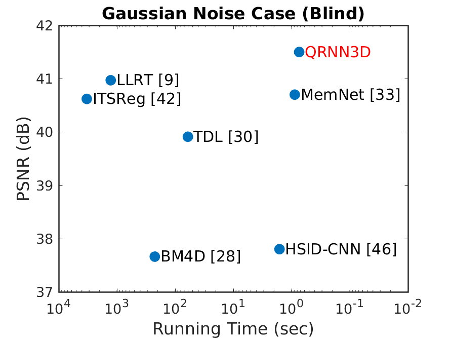
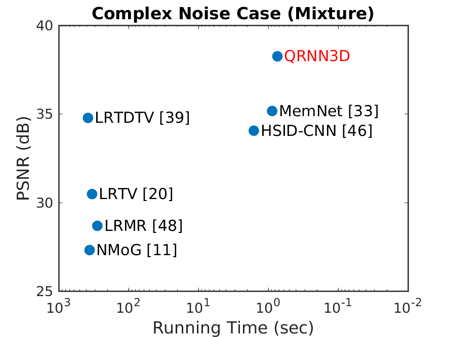
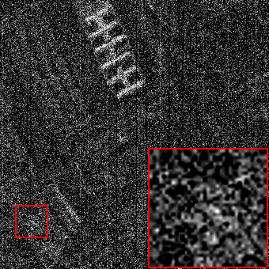
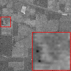
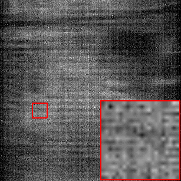

# QRNN3D

The implementation of TNNLS 2020 paper ["3D Quasi-Recurrent Neural Network for Hyperspectral Image Denoising"](https://arxiv.org/abs/2003.04547)


## Highlights

* Our network outperforms all leading-edge methods (2019)
on ICVL dataset in both Gaussian and complex noise cases, as shown below:


 

* We demonstrated our network pretrained on 31-bands natural HSI database (ICVL) can be utilized to recover remotely-sensed HSI (> 100 bands) corrupted by real-world non-Gaussian noise due to terrible atmosphere and water absorptions

     


## Prerequisites
* Python >=3.5, PyTorch >= 0.4.1
* Requirements: opencv-python, tensorboardX, caffe
* Platforms: Ubuntu 16.04, cuda-8.0


## Quick Start

### 1. Preparing your training/testing datasets

Download ICVL hyperspectral image database from [here](http://icvl.cs.bgu.ac.il/hyperspectral/) (we only need ```.mat``` version)

* The train-test split can be found in ```ICVL_train.txt``` and ```ICVL_test_*.txt```. (Note we split the 101 testing data into two parts for Gaussian and complex denoising respectively.)

#### Training dataset

*Note cafe (via conda install) and lmdb are required to execute the following instructions.*

* Read the function ```create_icvl64_31``` in ```utility/lmdb_data.py``` and follow the instruction comment to define your data/dataset address. 

* Create ICVL training dataset by ```python utility/lmdb_data.py```

#### Testing dataset

*Note matlab is required to execute the following instructions.*

* Read the matlab code of ```matlab/generate_dataset*``` to understand how we generate noisy HSIs.

* Read and modify the matlab code of ```matlab/HSIData.m``` to generate your own testing dataset

### 2. Testing with pretrained models

* Download our pretrained models from [OneDrive](https://1drv.ms/u/s!AqddfvhavTRiijWftKWgLfUgdSaD?e=nHGjIk) and move them to ```checkpoints/qrnn3d/gauss/``` and ```checkpoints/qrnn3d/complex/``` respectively.

* [Blind Gaussian noise removal]:   
```python hsi_test.py -a qrnn3d -p gauss -r -rp checkpoints/qrnn3d/gauss/model_epoch_50_118454.pth```

* [Mixture noise removal]:  
```python hsi_test.py -a qrnn3d -p complex -r -rp checkpoints/qrnn3d/complex/model_epoch_100_159904.pth```

You can also use ```hsi_eval.py``` to evaluate quantitative HSI denoising performance.  

### 3. Training from scratch

* Training a blind Gaussian model firstly by  
```python hsi_denoising_gauss.py -a qrnn3d -p gauss --dataroot (your own dataroot)```

* Using the pretrained Gaussian model as initialization to train a complex model:  
```python hsi_denoising_complex.py -a qrnn3d -p complex --dataroot (your own dataroot) -r -rp checkpoints/qrnn3d/gauss/model_epoch_50_118454.pth --no-ropt```

## Citation
If you find this work useful for your research, please cite: 
```bibtex
@article{wei2020QRNN3D,
  title={3-D Quasi-Recurrent Neural Network for Hyperspectral Image Denoising},
  author={Wei, Kaixuan and Fu, Ying and Huang, Hua},
  journal={IEEE Transactions on Neural Networks and Learning Systems},
  year={2020},
  publisher={IEEE}
}
```

## Contact
Please contact me if there is any question (kxwei@princeton.edu ~~kaixuan_wei@bit.edu.cn~~)  
